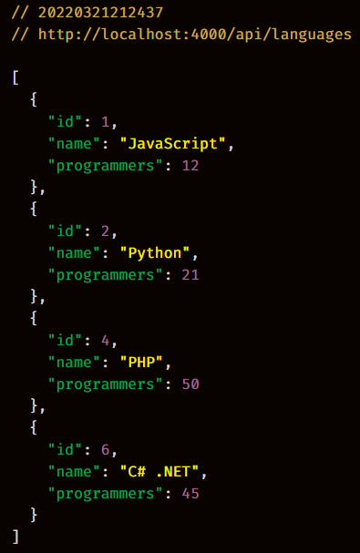

# REST API con Node.js, Express y MySQL | Crea y Prueba tu REST API (GET, POST, PUT, DELETE)

Hecha por Leonardo Muñoz

Para instalar los paquetes de Node.js necesarios (indicados en package.json):
### `npm i`

Crea y asigna tus variables de entorno dentro del archivo .env (en la raíz del proyecto):

### `HOST=host`
### `DATABASE=database`
### `USER=user`
### `PASSWORD=password`

  

  

